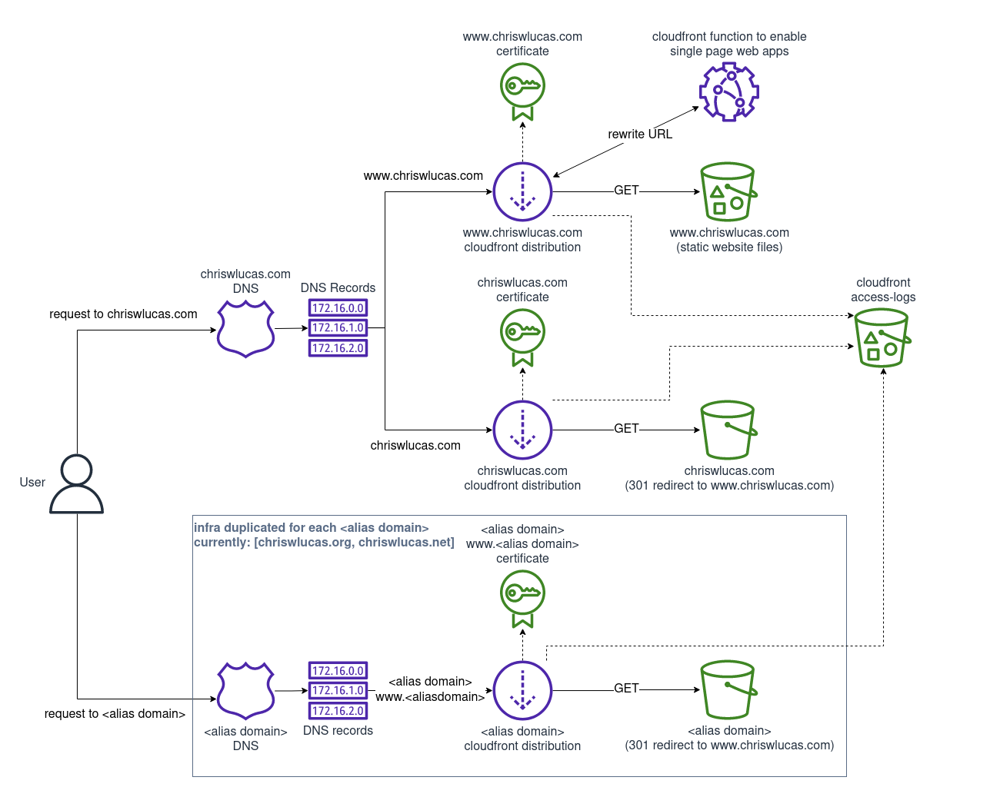

# personal-website-cdk

Contains the Infrastructure to host [www.chriswlucas.com](https://www.chriswlucas.com). Website content is hosted in [personal-website-content](https://github.com/cwlucas41/personal-website-content) and licensed separately from this infrastructure.

## TODO
* separate into multiple stacks, possibly nested
  * blocked on nested stacks diffing correctly
* CD pipeline to deploy website content
* backup origin bucket in a different region - mostly for style

## Infrastructure

### Features
* CloudFront hosting of website content in an S3 bucket
* Access logs for website with automatic deletion
* Alias domains and subdomains that get redirected to the website domain automatically
* Certificates with ACM that automatically renew
* MX records for Gmail
* TXT record for Gmail config and various verifications

### Web hosting and redirects diagram

## URLs expected to work
* http://chriswlucas.com
* http://www.chriswlucas.com
* https://chriswlucas.com
* https://www.chriswlucas.com
